<style type="text/css">
 caption {
      font-size: 1em;
      color: black;
 } 
 h1 {
  font-size: 20pt;
 }
 h2 {
  font-size: 18pt;
 }
 h3 {
  font-size: 16pt;
 }
</style>

**Author**: Michael Letheby

**Date**: 21^st^ June 2020

# Introduction

The purpose of this exercise was to create a **predictive model to identify the passengers that would survive the sinking of the Titanic**.

This exercise was sourced from [Kaggle](https://www.kaggle.com/) which is a great resource for data analysis/ science problems. This is a **supervised learning and a classification type problem**. As such I have used models such as CART and Random Forest which are suitable for these types of problems.

I went into this exercise relatively free of expectations having managed to avoid watching the Titanic thus far in my life. I expected that women and children were more likely to survive but tried to avoid letting this expectation influence how I approached the exercise. 

The tools used to complete this analysis were R and R Markdown. I've hidden most of the code in the published document for the sake of readability but the complete code can be found on my [Github](https://github.com/OnlyBuilt4CubanLinux/Titanic_Machine_Learning).

## About the Dataset

The link to the original dataset and problem can be found [here](https://www.kaggle.com/c/titanic). The site contains files to be used for training and testing the model as well as the format required by Kaggle for submission.

## Problem Statement

This is an easy one as it was provided by Kaggle.

The goal of the exercise is to predict whether a passenger will survive the ill-fated final voyage of the Titanic. The format for submission requires that passengers are classified using a binary flag to indicate whether or not they will survive. Correct predictions are ranked equally in this problem.

## Gaming the Results

This dataset was unique as it is based on a past (and well researched) event making it possible to "game" the results. For example I could have simply googled the list of survivors to achieve 100% (or close to) accuracy. 

However I wouldn't gain anything by doing this and certainly wouldn't learn anything that I could apply to future real-life problems. As such I limited myself to information that was either contained within the data provided or could have been researched prior to the event occurring (e.g. the layout of the ship which would be available in marketing material). 

## Process
  
At a high level I followed this process to approach the problem^[The first step would normally be defining the problem statement but this was provided by Kaggle]:

1. __Import the Data__: import all provided data.
2. __Explore and Clean the Data__: explore relationships between variables and clean missing data.
4. __Feature Engineering__: creation/ modification of variables likely to be useful in models.
5. __Model Development__: creation and evaluation of predictive models on train data.
6. __Model Selection__: selecting final model based on performance of model in preceding steps. 

It should be noted there is overlap in each of these steps due to the iterative nature of model building. As I learnt more about the data I went back to review and (hopefully) improve past sections.

## Libraries

I used the following packages in R for this project. There are many different ways of working with data in R but I have chosen to use these based on personal preference and experience. 


```r
# General Data Manipulation
library(corrplot) # For visualising basic correlation relationships
library(kableExtra) # CSS table formatting
library(RColorBrewer) # Additional colour palettes
library(scales) # Number formats and transformations
library(tidyverse) # General data manipulation and visualisation

# Model Development
library(caret) # Comprehensive package for model development and evaluation
library(pROC) # Plotting ROC 
library(ranger) # Fast implementation of Random Forest model
library(rattle) # Addtional functionality for model development
library(rpart) # CART model implementation
library(rpart.plot) # Additional functionality for plotting CART model
```


# Importing the dataset

In this section I imported the provided datasets, investigated the tables and performed some basic sense-checking of the data.

## Importing files

The first step was to __import the provided files__, train.csv and test.csv, and have a quick look at the data. From an R perspective I prefer to use glimpse() instead of head() for datasets with more than 6+ variables as I find it improves readability. 


```
## Rows: 891
## Columns: 12
## $ PassengerId <dbl> 1, 2, 3, 4, 5, 6, 7, 8, 9, 10, 11, 12, 13, 14, 15, 16, ...
## $ Survived    <dbl> 0, 1, 1, 1, 0, 0, 0, 0, 1, 1, 1, 1, 0, 0, 0, 1, 0, 1, 0...
## $ Pclass      <dbl> 3, 1, 3, 1, 3, 3, 1, 3, 3, 2, 3, 1, 3, 3, 3, 2, 3, 2, 3...
## $ Name        <chr> "Braund, Mr. Owen Harris", "Cumings, Mrs. John Bradley ...
## $ Sex         <chr> "male", "female", "female", "female", "male", "male", "...
## $ Age         <dbl> 22, 38, 26, 35, 35, NA, 54, 2, 27, 14, 4, 58, 20, 39, 1...
## $ SibSp       <dbl> 1, 1, 0, 1, 0, 0, 0, 3, 0, 1, 1, 0, 0, 1, 0, 0, 4, 0, 1...
## $ Parch       <dbl> 0, 0, 0, 0, 0, 0, 0, 1, 2, 0, 1, 0, 0, 5, 0, 0, 1, 0, 0...
## $ Ticket      <chr> "A/5 21171", "PC 17599", "STON/O2. 3101282", "113803", ...
## $ Fare        <dbl> 7.2500, 71.2833, 7.9250, 53.1000, 8.0500, 8.4583, 51.86...
## $ Cabin       <chr> NA, "C85", NA, "C123", NA, NA, "E46", NA, NA, NA, "G6",...
## $ Embarked    <chr> "S", "C", "S", "S", "S", "Q", "S", "S", "S", "C", "S", ...
```

There are 12 variables provided in train.csv (test.csv contains the same variables but is missing the target variable, Survived).

* **PassengerID**: looks to be the primary key and therefore a candidate for removal. Before I drop the field I will check for duplicates^[A review of PassengerID indicates no duplicates] and correlation with other fields.
* **Survived**: is my target variable. I will probably change this to a factor for use with model development later.
* **Pclass**: the information provided by Kaggle indicates this is the class the passenger was travelling in. 1 = 1st, 2 = 2nd, 3 = 3rd.
* **Name**: the name of the passenger. I can see that this contains the passenger's name and honorific (title). This variable will be useful for feature engineering later.
* **Sex**: sex of the passenger.
* **Age**: age of the passenger.
* **SibSp**: the number of siblings or spouses the passenger has aboard. 
* **Parch**: the number of parents or children the passenger has aboard.
* **Ticket**: ticket number. This is not unique as groups of passengers could use the same ticket.
* **Fare**: fare the passenger paid for their trip.
* **Cabin**: cabin number the passenger was travelling. Some customers have multiple cabins listed. 
* **Embarked**: port where the passenger embarked onto the Titanic.


## Sense-checking the dataset

Before progressing further I wanted to confirm that the train dataset provided was representative of the entire population. Looking online I could see that the survival rate of passengers on the Titanic was approximately 38%. 

Doing a quick calculation on the provided train dataset showed the same survival rate (where 1 = Survived and values are shown as percentages):


<table class="table table-striped" style="width: auto !important; margin-left: auto; margin-right: auto;">
<caption>(\#tab:TrainTable)Train Survival Rate</caption>
 <thead>
  <tr>
   <th style="text-align:center;"> Survived </th>
   <th style="text-align:center;"> Percentage (%) </th>
  </tr>
 </thead>
<tbody>
  <tr>
   <td style="text-align:center;"> 0 </td>
   <td style="text-align:center;"> 62 </td>
  </tr>
  <tr>
   <td style="text-align:center;"> 1 </td>
   <td style="text-align:center;"> 38 </td>
  </tr>
</tbody>
</table>

As shown in Table \@ref(tab:TrainTable) the train dataset had a survival rate of 38% which is matches that I found for the entire Titanic population. This gave me confidence that any models built on the train dataset would be predictive for the test dataset.

# Exploring the dataset
In this section I explored each of the variables in more detail to assist with data cleaning, feature engineering and model development.

To start with I looked at missing data and the correlation between each of the variable pairs.

## Missing Data

Exploring missing data was important as I would need to either clean the missing values or drop the variable altogether. In real life missing data is a good indicator of the reliability of the dataset and may highlight upstream issues in data collection that should be investigated.

Some models can handle missing data but I chose to process it manually due to the small size of the dataset.


<div class="figure" style="text-align: center">
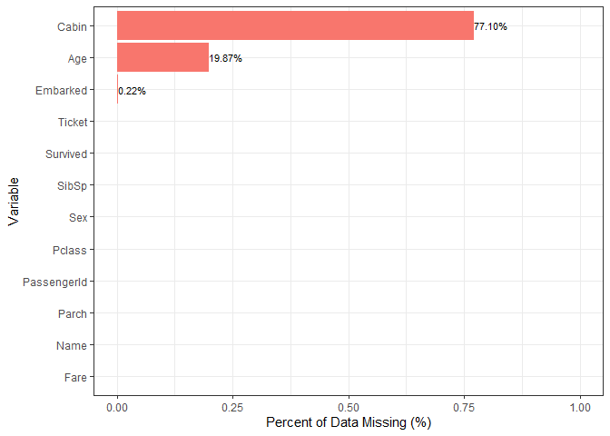
<p class="caption">(\#fig:NAs-Plot)Distribution of missing data</p>
</div>

Figure \@ref(fig:NAs-Plot) shows 3 variables with missing data; Cabin, Age and Embarked. At this stage I didn't drop any of the variables until I had explored them further. As Cabin had a significant amount of data missing my initial thought was to group all missing data into a new category. Given Age and Embarked had less data missing I could potentially impute the data with median and mode respectively. I replaced the missing data later in the process as I uncovered new relationships between my variables.

## Near Zero Variance

Variables with near zero variance are unlikely to be predictive and can be safely dropped. I used the nearZeroVar() function from the caret package to check whether any of the existing variables had a variance close to zero. None of the variables in the dataset met this condition so I didn't drop any variables at this stage.


## Correlation Plot

My next step was to create a correlation plot to see how my variables are interrelated. This only works on numeric data so I needed to convert my categorical variables into an equivalent number (best for ordered data) or a dummy variable. Pclass and Survived were imported as numeric types so I only needed to convert Sex and Embarked^[Embarked is not actually ordered but only has three values so I was comfortable using it as is] into their equivalent factor levels. I ignored Name, Ticket and Cabin at this stage as the data required further wrangling.


<div class="figure" style="text-align: center">
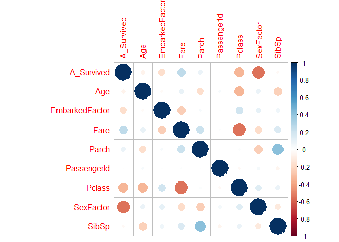
<p class="caption">(\#fig:Corr-Plot)Correlation Plot</p>
</div>

In Figure \@ref(fig:Corr-Plot) I renamed the Survived variable temporarily to A_Survived in order to force it to the top row. The key things to observe from Figure \@ref(fig:Corr-Plot) were:

* __PassengerID__ is not correlated to any variable. This was expected and meant the variable could be safely dropped prior to model creation.
* The Target variable is highly correlated to __SexFactor__ (negative correlation indicating Females are more likely to survive), __Pclass__ and __Fare__ (which display high collinearity).
* __SibSp__ and __Parch__ have low correlation to the target variable individually and became candidates for feature engineering.

## Variable exploration

With the information from the correlation plot I could explore some of the variables in more detail.

I started by examining the missing variables; __Age__, __Embarked__ and __Cabin__.

### Age


<div class="figure" style="text-align: center">
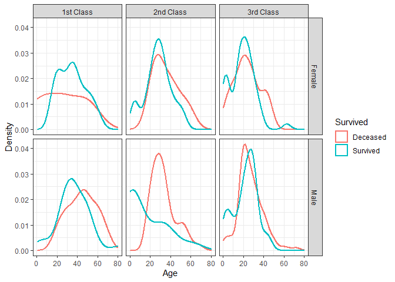
<p class="caption">(\#fig:Age-Plot)Distribution of Age Variable</p>
</div>

Figure \@ref(fig:Age-Plot) shows the distribution of Survived across Age, Sex and Pclass. This visualisation told me two useful things:

* These variables were all __good candidates for predictive variables__ as they display different behaviour between Survived outcomes.
* Age differs by a large amount between Sex and Pclass. Therefore I could use these groupings when imputing my missing data rather than using the entire population^[Alternatives for imputing this data include using a simple linear regression model or K-Nearest Neighbours].

<div class="figure" style="text-align: center">
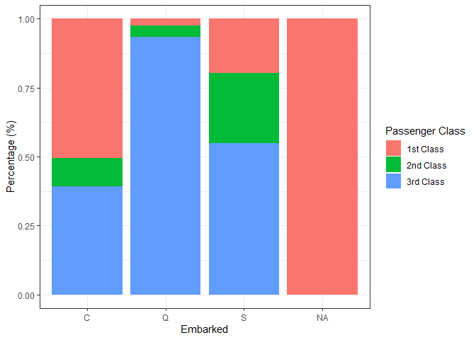
<p class="caption">(\#fig:EmbarkedClass-Plot)Distribution of Embarked Classes</p>
</div>

Figure \@ref(fig:Corr-Plot) showed that Embarked was closely correlated with Fare and Pclass.

<div class="figure" style="text-align: center">
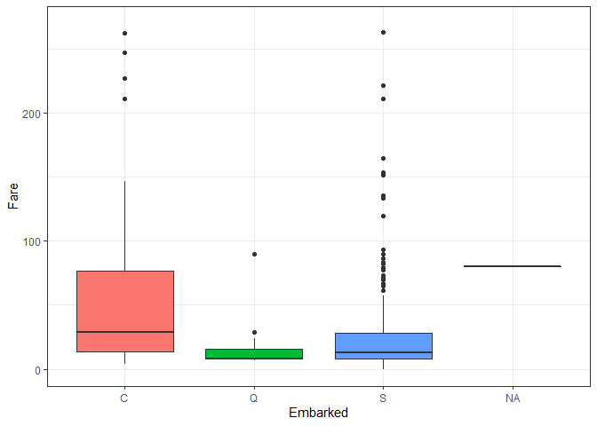
<p class="caption">(\#fig:EmbarkedFare-Plot)Distribution of Embarked Fares</p>
</div>

Based on Figure \@ref(fig:EmbarkedFare-Plot) it appeared that the missing Embarked values would most likely be port "C". To impute the missing data for Embarked I looked for the closest match between the passenger's fare and the mean fare for each value of Embarked. It should be noted that I manually changed altered the Y-Axis scale to a maximum Fare of 270 to better display the relationship between ports.

### Cabin
  
From my research (and using what could have reasonably known at the time of the ship's journey) I inferred that the letter in the Cabin variable related to the deck it was situated at. Generally the higher decks were primarily reserved for 1st class passengers with lower class passengers travelling in the lower decks. In the event of the Titanic disaster I would certainly want to be in one of the higher decks to be closer to the lifeboats.

Based on this information I created a __new variable__ called __Deck__ using the first letter of the existing Cabin variable. I then explored this variable further to investigate the extent of missing data.

<div class="figure" style="text-align: center">
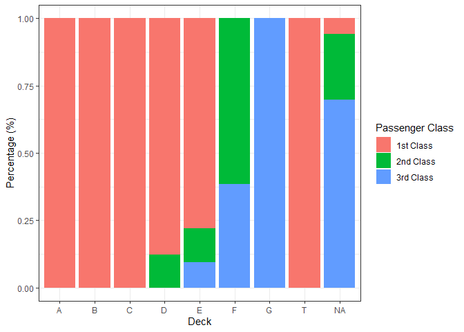
<p class="caption">(\#fig:DeckClass-Plot)Class Distribution by Deck</p>
</div>

Figure \@ref(fig:DeckClass-Plot) confirmed that the Decks were largely segregated by class and shows that most of the missing Deck values belong to 3rd Class passengers.

<div class="figure" style="text-align: center">
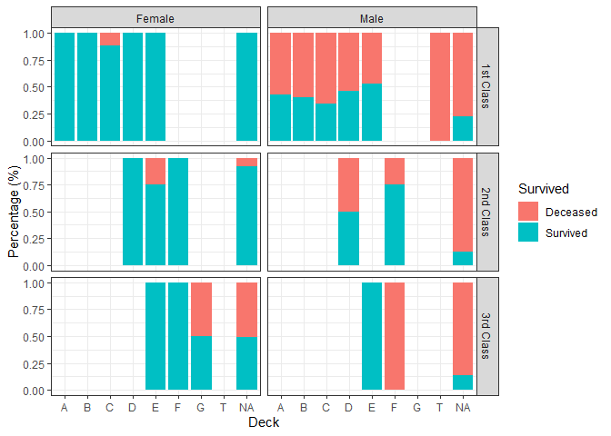
<p class="caption">(\#fig:DeckSurvival-Plot)Class Distribution by Deck</p>
</div>

From Figure \@ref(fig:DeckSurvival-Plot) there appears to be a relationship between Deck and Survival rate. Due to how much data was missing I wasn't confident I could impute Deck accurately. However I didn't want to drop the variable so instead I created a new category to represent the missing data.

### Sex and Class

<div class="figure" style="text-align: center">
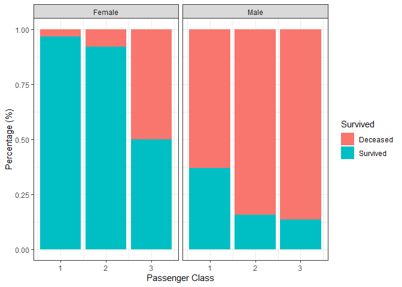
<p class="caption">(\#fig:Pclass-Plot)Survival Rates by Class</p>
</div>
Figure \@ref(fig:Pclass-Plot) confirmed that the Sex of the passenger was likely to be one of the most important features for developing my models. It was interesting to note that 3rd class Female passengers had a greater survival rate than 1st class Male passengers.

I plotted the graph again with absolute values to get a better idea of the relative size of each group.

<div class="figure" style="text-align: center">
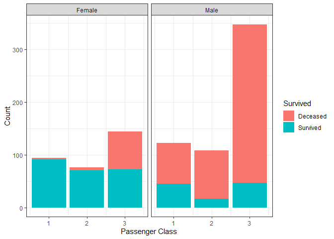
<p class="caption">(\#fig:PclassCount-Plots)Passenger Class Distributions</p>
</div>

It was interesting to see such a large amount of male passengers travelling in 3rd class. I suspected these would be mainly solo travellers which was one of the ideas behind the group size features discussed later.

### Fare and Class

The next plot was between Fare and Class to understand whether there was a clear separation between the variables. I also wanted to check how Survival rate correlates with Fare as tree-based models often tend towards variables with a wider ranger of variation.  
  
<div class="figure" style="text-align: center">
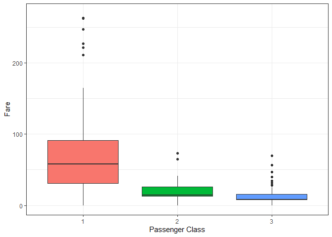
<p class="caption">(\#fig:PclassFare-Boxplot)Fare Distributions by Passenger Class</p>
</div>

Figure \@ref(fig:PclassFare-Boxplot) shows there are clear separations between Fare and Passenger Class as I expected. It should be noted that I manually changed altered the Y-Axis scale to a maximum Fare of 270 to better display the relationship between classes.

<div class="figure" style="text-align: center">
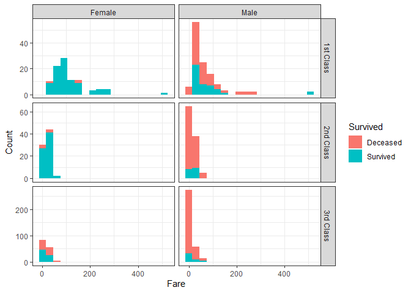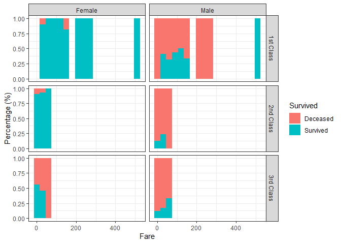
<p class="caption">(\#fig:PclassFare-Plot)Fare Distributions</p>
</div>

From the above figures I could see a clear relationship between Survival rates and Fare (which I binned for graphing purposes). Plotting both count and percentage made it easier to see where a pattern was being impacted by low volumes. 

## Replacing missing data

I made the decision not to combine the train and test datasets at the imputing stage to reduce any chance of leakage that could impact my model development.

Missing values for:

* __Embarked__ will be imputed based on the closest distance to the mean Fare of each embarked port.
* __Deck__ (created from Cabin) will be replaced by a new value "Z" to represent missing data.


I imputed the missing data for __Age__ in Section \@ref(title) as it was strongly related to the created Title variable.

## Outliers and Skewness

During the data exploration process I haven't mentioned any attempts to remove outliers or fix skewed variables. I did investigate the dataset with this in mind didn't make any changes. This was because there wasn't a significant amount of outliers and I was using models (CART and random forest) which are robust to these sorts of issues. If I had used a model like linear regression these issues would need to be accounted for prior to the model being developed.

# Feature Engineering

With a better understanding of my existing variables, and with most missing data cleaned, I could look for additional features to enrich my dataset.

## Title

As previously mentioned I created a new variable, __Title__, which I extracted from Name by observing that a passenger's title is the word immediately preceding the appearance of a ".". The list of extracted Title values was as follows:


```
## 
##       Mr.     Miss.      Mrs.   Master.       Dr.      Rev.      Col.    Major. 
##       517       182       125        40         7         6         2         2 
##     Mlle.     Capt. Countess.      Don. Jonkheer.     Lady.      Mme.       Ms. 
##         2         1         1         1         1         1         1         1 
##      Sir. 
##         1
```

From this result I could see a few potential groupings:

* __Mrs.__, __Ms.__ and __Mme.__ (Madame) can be combined. 
* __Miss.__ and __Mlle.__ (Mademoiselle) can be combined. These are generally terms for younger/unmarried women.
* __Mr.__ will be its own group. This will include both married and unmarried males.
* __Master.__ will be its own group. This is a title used for younger males and should capture a lot of children.
* All other titles will be grouped together as they are how low occurrence.

To see how these groupings look I plotted Title by Age:


<div class="figure" style="text-align: center">
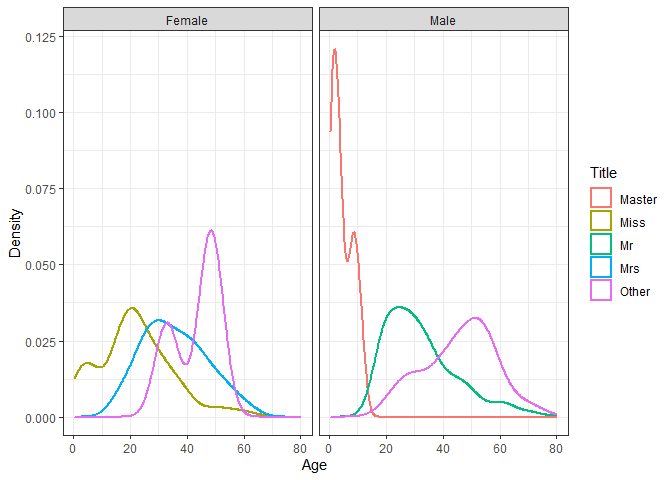
<p class="caption">(\#fig:Title-Plot)Age Distribution by Title</p>
</div>

Figure \@ref(fig:Title-Plot) showed Age varies significantly between Title. I therefore decided to use this variable and passenger class (for Mr. and Mrs.) to impute my missing Age data.


## Family Size

I combined the fields __SibSp__ and __Parch__ into a single variable called __FamilySize__. I also created a new flag to indicate whether a passenger is travelling with any family members called __FamilyFlag__.


<div class="figure" style="text-align: center">
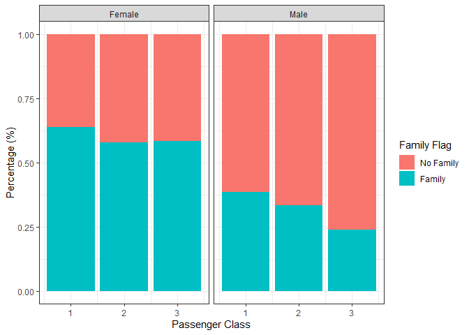
<p class="caption">(\#fig:Family-Plot)Family Groups Distribution</p>
</div>

## Ticket Size

Not all passengers will travel in groups only consisting of family members. Some passengers would be travelling as friends and others with maids or other servants. From the data I can see that groups of passengers tend to have the same __Ticket__. Having a variable for the total group size would be potentially useful. However unlike __FamilySize__ I don't start with the component variables so would need to calculate it myself. The issue with this is that groups may be split across the entire population making any created variable inaccurate or potentially misleading.

To see how much of a problem this could be I calculated ticket group size based only on train and then with the combined dataset to observe the variance. Unlike Section \@ref(replacing-missing-data) I was comfortable taking this approach as I was not imputing any missing data.


<table class="table table-striped" style="width: auto !important; margin-left: auto; margin-right: auto;">
<caption>(\#tab:TicketGroupTable)Ticket Group Comparison</caption>
 <thead>
  <tr>
   <th style="text-align:center;"> Difference </th>
   <th style="text-align:center;"> Count </th>
   <th style="text-align:center;"> Frequency </th>
  </tr>
 </thead>
<tbody>
  <tr>
   <td style="text-align:center;"> Complete </td>
   <td style="text-align:center;"> 566 </td>
   <td style="text-align:center;"> 83% </td>
  </tr>
  <tr>
   <td style="text-align:center;"> Some Missing </td>
   <td style="text-align:center;"> 115 </td>
   <td style="text-align:center;"> 17% </td>
  </tr>
</tbody>
</table>

From Table \@ref(tab:TicketGroupTable) 17% of the tickets in the train data have missing members when compared to the test data. This level of variance was acceptable to me so I created a new variable __TicketSize__ based off the combined trainData and testData population.


## Feature Selection


This is not a large dataset so there was less need to filter out variables through feature selection. The models I used also have implicit feature selection and will only use variables they deem predictive. Despite both of these points I dropped the below variables before training my models:

* __PassengerId__: Primary Key.
* __Name__: used to create Title.
* __SibSp__: used to create FamilySize and FamilyFlag.
* __Parch__: used to create FamilySize and FamilyFlag.
* __Ticket__: used to create TicketSize and TicketGroupFlag.
* __Cabin__: used to create Deck.

# Model Development

After processing the data I could begin model development. As this was a binary classification problem I decided to use a CART and random forest model as they are appropriate for this type of problem and also relatively simple to create.

To score each model I need to submit the data to Kaggle which will evaluate the results. As Kaggle only allows a limited number of submissions within a 24 hour period I had to keep my parameter tuning to a minimum as I didn't want to wait too many days to finish this task. 

## Establishing a baseline

Before building the model I needed to have a baseline to test it against. A classic example is to compare each model against one which is purely random. However with this dataset I created a baseline based on the knowledge that females are more likely to survive than males (Figure \@ref(fig:Pclass-Plot)). The baseline assumes:

* All female passengers survive.
* All male passengers do not survive.


Using this assumption I submitted the results to Kaggle and achieved an accuracy of 76.5% (i.e. the survival status of passengers is predicted correctly 76.5% of the time). Any model developed must beat this baseline to be considered effective.

## Decision Tree

The first model I created was CART (Classification and Regression Tree) using the rpart package. 

Before I could use the model I needed to make a few changes to my dataset:

* Parse Survived as a factor (1 = Survived, 0 = Deceased)
* Apply all transformations made on the train dataset to the test dataset


My aim was to initially create the rpart model using default parameters and then perform some basic optimisation. To reduce the chance of overfitting I used k-fold cross-validation when optimising the model on my training data. I decided to perform the optimisation using the trainControl() function from the caret package. 

The target variable is relatively balanced so I based my evaluation on AUC and a confusion matrix. 


<div class="figure" style="text-align: center">
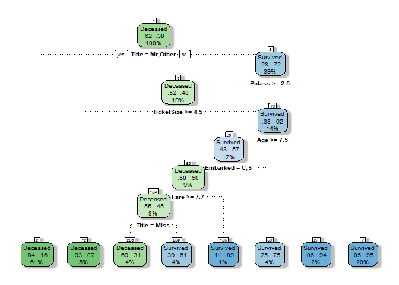
<p class="caption">(\#fig:CARTDefault-Plot)CART Default Parameters</p>
</div>

Figure \@ref(fig:CARTDefault-Plot) shows the decision tree generated using the rpart() package and default parameters. Each node shows the following information (described top to bottom, left to right):

* __Classification__: indicates whether a passenger would be classified as "Survived" or "Decreased".
* __Percentage of Split that is Deceased__ (e.g. the first split indicates the entire train population is 62% Deceased).
* __Percentage of Split that Survived__ (e.g. the first split indicates the entire train population is 38% Survived).
* __Percentage of Train__ Population.
* Rule for further splits (not applicable for terminal nodes).

Figure \@ref(fig:CARTDefault-Plot) shows that the Title feature is the most predictive feature used by the model. This makes sense as it combines the predictive power of the passenger's Sex and Age.


```
## Confusion Matrix and Statistics
## 
##           Reference
## Prediction Deceased Survived
##   Deceased      517      103
##   Survived       32      239
##                                           
##                Accuracy : 0.8485          
##                  95% CI : (0.8232, 0.8714)
##     No Information Rate : 0.6162          
##     P-Value [Acc > NIR] : < 2.2e-16       
##                                           
##                   Kappa : 0.6666          
##                                           
##  Mcnemar's Test P-Value : 1.695e-09       
##                                           
##             Sensitivity : 0.6988          
##             Specificity : 0.9417          
##          Pos Pred Value : 0.8819          
##          Neg Pred Value : 0.8339          
##              Prevalence : 0.3838          
##          Detection Rate : 0.2682          
##    Detection Prevalence : 0.3042          
##       Balanced Accuracy : 0.8203          
##                                           
##        'Positive' Class : Survived        
## 
```
The confusion matrix shows that this model is very good at correctly predicting passengers that will not survive (94.2% Specificity) but does not perform as well predicting passengers that do survive (69.9% Sensitivity). Since this competition weights each outcome equally this is not necessarily an issue with the model. 

Overall this is a very good score with an accuracy of 84.9% on the train dataset. Despite the lower Sensitivity the model performs well overall since most passengers did not survive the sinking. 


Applying this model on the test dataset and submitting to Kaggle I get a score of 79.4%. This is a good score which beats the baseline that I established earlier. 

The next step was to use the optimise the CART model using the caret package. 


<div class="figure" style="text-align: center">
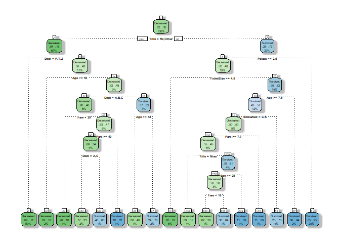
<p class="caption">(\#fig:CARTOpt-Plot)CART Optimised Parameters</p>
</div>

Figure \@ref(fig:CARTOpt-Plot) shows the new rpart model that was created using the "optimal" complexity parameter. The tree is two levels deeper than Figure \@ref(fig:CARTDefault-Plot) and splits out male passengers further.

After I tested this model I achieved an accuracy of 77.9% after submission to Kaggle. This is worse than the default model! It appears the new model overfit the data to the train dataset. This is a relatively simple dataset so this is unsurprising. I could continue to play around with the parameters but I'm unlikely to improve significantly on the default model and this is also just a learning exercise so I decided to leave it here.


## Random Forest

The second model I used was a Random Forest which is similar to CART but can reduce model variance.

I started by creating a Random Forest model using the default parameters with a plan to then perform optimisation using the caret package. I used the ranger package in R which I prefer for Random Forest models due to its faster speed.


```
## Confusion Matrix and Statistics
## 
##           Reference
## Prediction Deceased Survived
##   Deceased      533       39
##   Survived       16      303
##                                           
##                Accuracy : 0.9383          
##                  95% CI : (0.9204, 0.9532)
##     No Information Rate : 0.6162          
##     P-Value [Acc > NIR] : < 2.2e-16       
##                                           
##                   Kappa : 0.8678          
##                                           
##  Mcnemar's Test P-Value : 0.003012        
##                                           
##             Sensitivity : 0.8860          
##             Specificity : 0.9709          
##          Pos Pred Value : 0.9498          
##          Neg Pred Value : 0.9318          
##              Prevalence : 0.3838          
##          Detection Rate : 0.3401          
##    Detection Prevalence : 0.3580          
##       Balanced Accuracy : 0.9284          
##                                           
##        'Positive' Class : Survived        
## 
```

The default Random Forest model shows an improved Sensitivity (88.6%) compared to the CART models and a very high accuracy of 93.7%. The accuracy seemed too high to me leading me to suspect the model is overfitting the train data. As Random Forest is an ensemble model I can't see direct rules like with CART which is one of the disadvantages of more complicated Machine Learning methods. However I can print out the variables that the model considered most important in developing the model.


```
##             Sex            Fare             Age           Title          Pclass 
##       81.667763       54.687123       48.218699       41.595918       23.797502 
##            Deck      TicketSize      FamilySize        Embarked TicketGroupFlag 
##       23.153646       20.946696       19.543198        9.624170        4.836557 
##      FamilyFlag 
##        4.459940
```

The Random Forest model appears to be using most of the same variables as the CART model albeit with different weightings. 


After using the model on the test data and submitting the results to Kaggle I achieved an accuracy of 78.9%. This is a good score but was below the default parameters of the original CART model. 

I reran the Random Forest model using the optimisation tool from caret and achieved an accuracy on the train data of 95%. The model was overfit even further! This was one of the first times I used the optimisation tool from caret and I clearly need to reread the documentation as it is continuously overfitting my data.

I decided to manually revise the parameters by introducing higher regularisation (reduced rate of learning) and restricted the model to shallower trees which should reduce to overfitting. Doing this I managed to get an accuracy of 79.4% on Kaggle which is better than the default Random Forest and in-line with my original CART model. 


# Model Selection


<table class="table table-striped" style="font-size: 12px; width: auto !important; margin-left: auto; margin-right: auto;">
<caption style="font-size: initial !important;">(\#tab:ModelSummaryTable)Model Summary</caption>
 <thead>
  <tr>
   <th style="text-align:left;">   </th>
   <th style="text-align:center;"> Accuracy </th>
   <th style="text-align:center;"> Sensitivity </th>
   <th style="text-align:center;"> Specificity </th>
   <th style="text-align:center;"> Kaggle Score </th>
  </tr>
 </thead>
<tbody>
  <tr>
   <td style="text-align:left;font-weight: bold;"> CART Default </td>
   <td style="text-align:center;font-weight: bold;"> 0.8485 </td>
   <td style="text-align:center;font-weight: bold;"> 0.6988 </td>
   <td style="text-align:center;font-weight: bold;"> 0.9417 </td>
   <td style="text-align:center;font-weight: bold;"> 0.794 </td>
  </tr>
  <tr>
   <td style="text-align:left;"> CART Optimised </td>
   <td style="text-align:center;"> 0.8721 </td>
   <td style="text-align:center;"> 0.7661 </td>
   <td style="text-align:center;"> 0.9381 </td>
   <td style="text-align:center;"> 0.779 </td>
  </tr>
  <tr>
   <td style="text-align:left;"> Random Forest Default </td>
   <td style="text-align:center;"> 0.9383 </td>
   <td style="text-align:center;"> 0.8860 </td>
   <td style="text-align:center;"> 0.9709 </td>
   <td style="text-align:center;"> 0.789 </td>
  </tr>
  <tr>
   <td style="text-align:left;font-weight: bold;"> Random Forest Optimised </td>
   <td style="text-align:center;font-weight: bold;"> 0.8485 </td>
   <td style="text-align:center;font-weight: bold;"> 0.7515 </td>
   <td style="text-align:center;font-weight: bold;"> 0.9089 </td>
   <td style="text-align:center;font-weight: bold;"> 0.794 </td>
  </tr>
</tbody>
</table>

Table \@ref(tab:ModelSummaryTable) shows the results for each of the 4 models I created. 

From a Kaggle perspective I want to select the model with the highest score. The CART Default or Random Forest Optimised model have the equal highest scores so either would be suitable. 

I probably could have achieved a higher Kaggle score by trying to optimise different parameters with each model or taking actions like binning continuous variables (e.g. Fare). As previously mentioned however I didn't want to spend too long on this problem as Kaggle only allows a limited number of submissions within a 24 hour period and I was relatively satisfied with the performance. 

In a real-life scenario I would prefer to __choose__ the __simplest possible model__ that can __achieve a suitably high score__. A simple model is useful (especially one with visible rules such as CART) because:

* Easier to explain to business stakeholders.
* Companies may be required by regulation to show why business decisions were made (e.g. why a customer was declined for a loan).
* Can be implemented within a number of systems.
* Reduced chance of human error during implementation and future review.

Although not present in this particular problem another factor to consider is the value of each classification. Often one of the options in a classification problem is more valuable; there are __costs associated with making an incorrect choice__. For example if I'm trying to approve a customer for a home loan:

* A correct choice (customer pays back the loan) will result in a small profit
* An incorrect choice (customer defaults on loan) will result in a large loss

Based on the relative simplicity of the problem, and its respective high performance, I would choose to select the default CART model for this problem. 

# Other

## Full R Code

The entire R code for this analysis can be found at the [Github repo for this project](https://github.com/OnlyBuilt4CubanLinux/Titanic_Machine_Learning).

## Notes on R

This report was created using R Markdown with the code written in R and version control managed through Github. This workflow provides allows the development and presentation of analysis within the same environment and reduces the margin for human error. 

R is an excellent language for data analysis and modelling work. Alongside Python it is an open-source language with significant community support and is a powerful and flexible tool for data professionals. I highly recommend [R for Data Science](https://r4ds.had.co.nz/) by Garrett Grolemund and Hadley Wickham as a resource for beginners.

## Contact

If you'd like to get in touch please contact me at my [LinkedIn](https://www.linkedin.com/in/letheby/). Please include a message as I won't accept a blank invite from someone I don't know.
